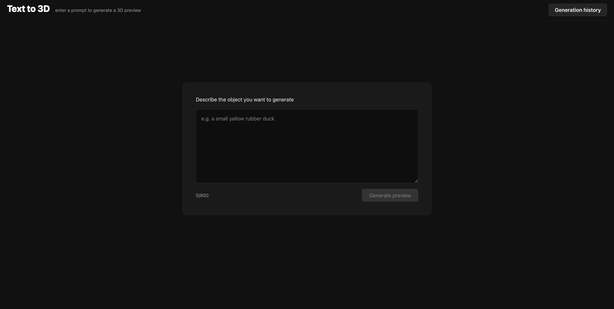
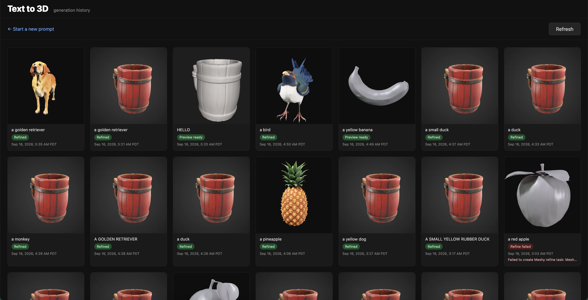
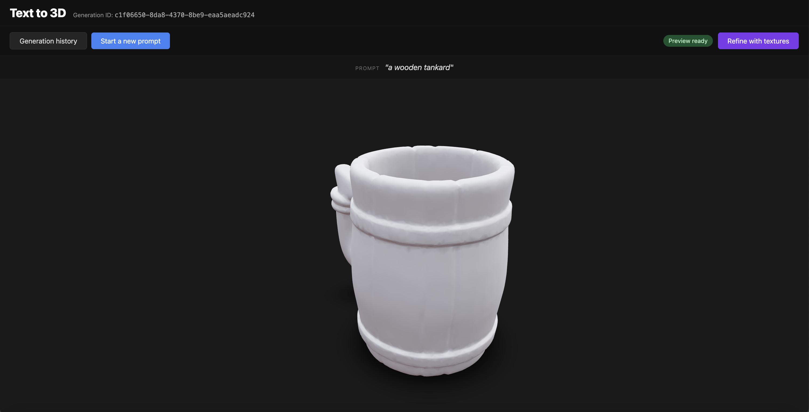
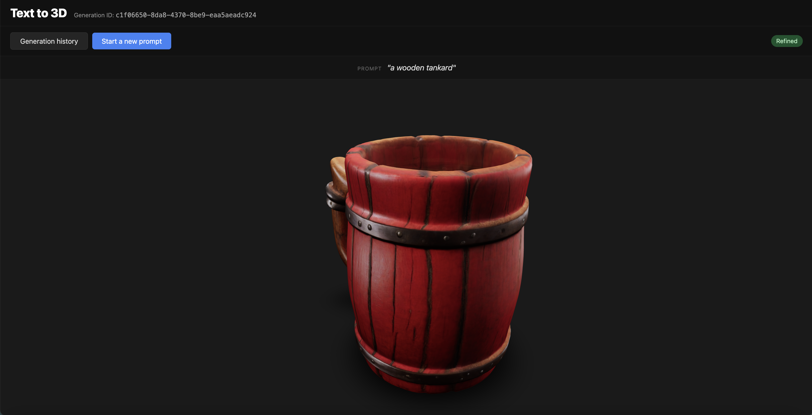

# AI Workflow

**Architecture and milestone status are in [`PLAN.md`](PLAN.md) and [`PROGRESS.md`](PROGRESS.md). Instructions on how to run the project is in [`README.md`](README.md)**

## 1. What the Project Does

This project is a local-first Text-to-3D web platform. It allows a user to enter a natural-language prompt, generate a 3D preview, view the generated model in the browser, track previous generations, and optionally refine a preview into a textured 3D asset.

The application is built around Meshy's Text to 3D API:

https://docs.meshy.ai/en/api/text-to-3d

Meshy's Text to 3D API converts a text prompt into a 3D model, it has a two-stage generation workflow: **preview** first, then **refine** with finer textures if the user decides the preview is worth improving.

### User flow

The user starts from a simple prompt page. They describe the object they want to generate, and the frontend sends the prompt to the backend.

After submitting a prompt, the backend creates a Meshy preview task and tracks its progress. The application also keeps a **"Generation history"** page, so the user can leave the detail page and later return to previous generations.

### Preview vs. refine

The **preview** stage generates the initial 3D mesh from the text prompt. It is useful for quickly checking whether the generated object has the right overall shape before spending additional time or credits on texture generation.

For example, this preview result captures the shape of **a wooden tankard**, but it is still mostly untextured:

The **refine** stage is triggered only after the preview is ready and the user clicks **Refine with textures**. The backend then creates a Meshy refine task based on the completed preview task. The refined result adds color, material appearance, and texture details to the model.

### System behavior

Behind this user flow, the system includes:

- a React frontend for prompt submission, generation history, status display, and 3D model viewing;
- a FastAPI backend that owns all Meshy API communication;
- a SQLite database for persistent task metadata;
- local file storage for generated assets such as GLB models and thumbnails;
- a background watcher that polls Meshy task status and downloads completed assets;
- automated backend tests that validate the task workflow without spending real Meshy credits.

The project is designed as a small but complete full-stack system. It demonstrates how an AI-enabled application can be structured with clear backend ownership, persistent task tracking, asynchronous background work, local reproducibility, and a user-controlled preview-to-refine workflow.

## 2. Why I Chose This Project

I chose this project because this data platform combines several areas that are directly relevant to modern software engineering: backend service design, asynchronous task tracking, API integration, persistent storage, frontend interaction, and validation of AI-generated outputs.

I was also interested in the broader meaning of text-to-3D generation. Compared with traditional 3D asset creation, which often requires specialized modeling tools and manual artistic work, text-to-3D lowers the entry barrier by letting users describe an object in natural language and receive a usable 3D asset. This kind of workflow has potential value for game development, AR/VR prototyping, product visualization, education, and rapid creative iteration. Meshy provides the generative model capability, while this project focuses on building the software platform around that capability: task orchestration, history tracking, asset persistence, and user-controlled refinement.

Text-to-3D generation is a good example of an AI-enabled product workflow that cannot be handled as a simple request-response API call. A generation task may take time to complete, may fail, may produce multiple types of artifacts, and may need follow-up actions from the user. This makes it a useful project for demonstrating system design beyond a basic demo.

The project also gave me a concrete way to design around real-world engineering concerns:

- **External API integration:** the backend needs to communicate with Meshy, handle task creation, poll task status, interpret responses, and manage failure cases.
- **Asynchronous workflow:** preview and refine tasks are long-running operations, so the system needs background tracking instead of blocking the user request.
- **Persistent task state:** users should be able to leave the page, refresh the browser, restart the backend (by accident), and still recover previous generation records.
- **User-controlled cost and quality trade-off:** the application separates *preview* from *refine*, allowing the user to inspect the rough 3D shape before deciding whether to generate textures.
- **Local asset management:** generated model files and thumbnails are downloaded and served locally, so the application is not fully dependent on temporary external asset URLs.
- **Testing and validation:** the backend workflow can be tested with mocked Meshy responses, which allows task creation, polling, state transitions, and error handling to be validated reproducibly.

I also chose this project because it is close to the type of engineering work I want to demonstrate: building reliable application infrastructure around AI capabilities. The AI model for text-to-3D itself is provided by Meshy, but the surrounding system still needs careful software engineering. The application has to manage task lifecycle, state transitions, API boundaries, error handling, persistence, and frontend/backend coordination.

In that sense, the project is not only about generating a 3D model. It is about building a small but complete platform around an AI service, where the user experience depends on reliable backend orchestration and clear system behavior.

## 3. AI Tools and Models Used

For this project, I used Cursor as the main AI-assisted coding environment. I used AI throughout the project, but I kept the workflow interactive: I first clarified the design intent, proposed the architectural design and review the implentation plans proposed by AI, asked AI to help with focused implementation steps, reviewed the AI-generated code quality before human-involved through testing, ran tests or builds, and then refined the implementation when issues appeared.

The main AI tools and models I used were:

- **Cursor**: Cursor was the primary AI coding tool I used to work inside the repository. I used it to edit backend and frontend code, generate tests, debug failures, and iterate on implementation details. I also used project-level rules and planning documents to keep the generated code aligned with the intended architecture.

- **Claude Fable 5**: I used Claude Fable 5 mainly during the early planning stage. It helped me discuss the system architecture, break the project into milestones, and reason about more complex features before implementation. This was especially useful for deciding the overall backend workflow, the preview/refine lifecycle, and how the application should recover task state after restart.

- **Claude 4.7 Opus**: I used Claude 4.7 Opus for code implementation, test generation, and debugging. It was useful for larger coding tasks that required understanding multiple files at once, such as backend task state management, API route behavior, and test coverage.

- **Cursor Grok 4.6**: I also used Cursor Grok 4.6 for implementation and debugging inside Cursor. I used it for iterative code edits, frontend/backend integration fixes, and checking whether generated changes were consistent with the project plan.

The application itself also uses an external AI service, **Meshy's Text to 3D API**: https://docs.meshy.ai/en/api/text-to-3d

Meshy provides the generative AI capability that converts a text prompt into a 3D asset. My project does not train or host the 3D generation model directly. Instead, it focuses on the application and infrastructure layer around that model: task creation, asynchronous polling, preview/refine state management, SQLite persistence, local asset storage, generation history, and frontend visualization.

## 4. How AI Was Integrated Into My Engineering Workflow

I integrated AI into the project as a structured engineering partner rather than as a one-shot code generator. The workflow was designed to keep me in control of the architecture, feature scope, validation, and final decisions.

### Planning before implementation

Before writing code, I used AI in **Plan Mode** to discuss the system architecture I proposed and break the project into milestones. The goal was to decide the stable project shape first, then implement one feature at a time.

The planning phase produced two important project documents:

- `PLAN.md`: the architecture summary, system constraints, API surface, persistence strategy, testing strategy, and milestone roadmap.
- `PROGRESS.md`: a living status document for progress synchronization that records what has been completed, what is currently being worked on, validation results, engineering decisions, and known risks.

This helped prevent the project from becoming an unstructured sequence of generated code changes. The architecture was decided up front by me: a React frontend, a FastAPI backend, a SQLite database, local asset storage, backend-owned Meshy communication, and one application-level generation task wrapping both preview and refine.

### Project rules for AI-assisted development

I also created a project rule file under `.cursor/rules/project.mdc` to guide the AI coding agent. The rule made the workflow explicit:

1. Inspect the existing code and documents before starting a feature.
2. Make a concise implementation plan for the current milestone and seek for human approval
3. It will explicitly Ask for clarification when requirements are unclear, missing or external resources (e.g. API keys) are needed, instead of silently invent behavior or make major assumptions
4. Implement only the requested feature.
5. Add or update meaningful unit/integration/system tests together with the feature.
6. Run relevant tests and build checks to check the code quality.
7. Fix failures before moving on.
8. Update `PLAN.md` and `PROGRESS.md` so that everything is aligned for further tasks.
9. Suggest a commit message.
10. Stop and wait before starting the next milestone.

This rule was important because it turned AI usage into a repeatable development workflow. Instead of asking the model to build the whole application at once, I used it in a controlled milestone-by-milestone loop.

### Milestone-based implementation loop

Most features followed the same pattern:

1. I gave the AI agent the current milestone goal.
2. The agent inspected the existing repository state and relevant docs.
3. It proposed a focused implementation plan and seeked my approval, asked for clarification or resources when there is confusions.
4. It modified the code for that milestone only.
5. It added or updated tests when the milestone involved backend behavior.
6. It ran validation commands such as `pytest` or `npm run build`.
7. When the feature creates or completes a meaningful user-visible flow, tell the user that the project is ready for manual smoke testing so that I can go through the workflow on the platform (with the real API keys) to check whether the platform works as expected.
8. It updated `PLAN.md` and `PROGRESS.md`.
9. I reviewed the output and committed the milestone separately.

This process made the development workflow controllable, enhance the code quality, and ensure the commit history easier to understand. Each commit corresponds to a meaningful project step, such as backend scaffold, persistence, Meshy client, preview flow, file serving, frontend viewer, prompt flow, refine flow, generation history, and robustness polish.

### Examples of AI integration during implementation

For backend milestones, AI helped translate the architecture into concrete FastAPI modules. I used tests to validate that generated backend code matched the expected task lifecycle.

For frontend milestones, AI helped build the React/Vite interface incrementally. The frontend started with a standalone React Three Fiber viewer using a sample GLB, then grew into a prompt submission flow, a polling-based generation detail page, a user-triggered refine workflow, and finally a generation history tracker.

For robustness work, AI helped reason about failure cases that are easy to miss in a normal demo, such as backend restart during an in-flight Meshy task. This led to startup reconciliation: when the backend starts, it scans non-terminal database rows and respawns the correct watcher if a Meshy task ID already exists.

### Validation-driven use of AI

I did not treat AI-generated code as correct by default. After each meaningful change, I validated the project through tests, builds, or manual smoke testing.

Backend behavior was validated with `pytest`. The tests use mocked Meshy responses and temporary SQLite databases, so they check the application logic deterministically. This was especially important for state transitions, watcher behavior, API error handling, local file serving, and startup reconciliation.

Frontend behavior was validated through TypeScript and Vite builds, plus manual browser testing. For example, I manually checked that the prompt form submitted correctly, the viewer displayed generated GLB files, polling updated task status, refine replaced the preview model when ready, and the history tracker showed previous generations.

### Human review and correction

AI helped accelerate implementation, but I still made the final engineering decisions. When the AI proposed code or behavior, I checked whether it matched the project requirements, the current milestone scope, and the existing architecture.

This was especially important for the task lifecycle. The project has several states across preview and refine, and incorrect transitions could make the UI poll forever, trigger refine too early, or lose access to a generated model. I used the AI agent to propose implementations, but relied on code review, tests, and manual checks to confirm the behavior.

Overall, AI was integrated into my workflow as a planning, implementation, debugging, and documentation assistant. The main value was not simply generating code faster, but helping me maintain a structured development loop: plan, implement, validate, document, commit, and then move to the next milestone.

## 5. Examples Where AI Improved Productivity or Influenced Engineering Decisions

### Example 1: Turning a broad product idea into an incremental engineering roadmap

One major productivity improvement came from using AI during the early planning stage. At the beginning, the project idea was broad: build a Text-to-3D web application around the Meshy API with prompt submission, preview generation, optional refine, a 3D viewer, task history, persistence, and asynchronous processing.

Instead of immediately asking AI to generate the whole application, I used AI in Plan Mode to first proposed my architecture design, clarify the project scope, discuss the architecture. This helped me turn the idea into a concrete engineering roadmap with stable decisions:

- React + Vite + React Three Fiber for the frontend;
- FastAPI for the backend;
- SQLite for persistent generation metadata;
- local file storage for generated GLB files and thumbnails;
- backend-only Meshy API access;
- one application-level generation row wrapping both preview and refine;
- frontend polling for task status;
- backend watchers for Meshy task progress;
- mocked Meshy responses for automated tests.

This significantly improved my productivity because it reduced ambiguity before implementation. Once the architecture and milestones were written into `PLAN.md` and progress are written in `PROGRESS.md`, each later coding session had a clear target and know about when to resume from. The AI agent could inspect the current state, implement only the next milestone, update tests, update documentation, and stop for review.

This also made the commit history more meaningful. Instead of one large AI-generated commit, the project evolved through understandable steps: scaffold, persistence, Meshy client, preview flow, read endpoints and file serving, frontend viewer, prompt flow, refine flow, task tracker, and robustness improvements.

### Example 2: Designing startup reconciliation for interrupted background tasks

A second important example was the startup reconciliation design. The application uses in-process background watchers to poll Meshy tasks and download completed assets. This is simple and fits the project architecture, but it creates a real reliability issue: if the backend process stops while a preview or refine task is still running, the in-memory watcher disappears.

AI helped me reason through this failure mode and compare the behavior before and after the fix:

- Before reconciliation, a generation could remain stuck in `PREVIEW_IN_PROGRESS` or `REFINE_IN_PROGRESS` forever after a backend restart.
- Meshy might still complete the task externally, but the application would not know to poll again or download the resulting GLB file.
- After enough time, the temporary Meshy asset URL could expire, making the result unrecoverable.

This discussion influenced the Milestone 10 (M10) engineering decision to add startup reconciliation. On backend startup, the app scans non-terminal database rows. If a row already has a Meshy task ID, the backend respawns the correct watcher and continues polling. If a row is still in a pending state but has no Meshy task ID, the app marks it failed instead of blindly retrying task creation.

This decision improved the reliability of the system without changing the overall architecture. It preserved the lightweight single-process design, but made it safer across backend restarts. It also led to additional tests for reconciliation behavior, so the fix was validated rather than treated as only a manual workflow improvement.

## 6. Examples Where AI-Generated Output Required Correction, Debugging, Refinement, or Validation

### Example 1: Refinement polling got stuck at 0% after clicking "Refine with textures"

One issue I found during manual testing was in the refine workflow. After a preview was ready, I clicked **Refine with textures** using Meshy's default test-mode API key. The UI switched into the refine state, but the progress bar stayed at 0% and did not move. However, after refreshing the page, the refined model appeared immediately.

At first, this looked like it might be caused by the test-mode key because the dummy API returns results very quickly. After debugging the frontend polling logic, I found that it was actually an application bug.

The root cause was in the React polling effect. The detail page used terminal-state detection to decide whether polling should continue. This worked for the preview flow because `PREVIEW_PENDING` and `PREVIEW_IN_PROGRESS` naturally transition into `PREVIEW_SUCCEEDED` while polling is already active. However, refine is different: the page first reaches `PREVIEW_SUCCEEDED`, which is a terminal state for the preview stage, so polling stops. When the user later clicks **Refine with textures**, the frontend state changes to `REFINE_IN_PROGRESS`, but the polling effect did not restart because it was only keyed on the generation ID.

As a result, the backend had already created and completed the refine task, but the frontend did not send another `GET /api/generations/{id}` request unless the page was refreshed. Refreshing worked because the component mounted again, fetched the latest generation state, and immediately saw `REFINE_SUCCEEDED`.

The fix was to make the polling effect depend on whether the current generation is still polling, not only on the generation ID. After that change, clicking refine moves the generation from a preview-terminal state back into a non-terminal refine state, and the frontend polling loop starts again automatically.

This example reminded me that even when the backend state machine is correct, frontend lifecycle logic still needs to be tested with real user interactions. The bug only appeared when moving from a completed preview into a user-triggered refine flow, so it was not caught by simply testing the initial preview generation path.

### Example 2: Generation history showed stale thumbnail and stale completion time after refine

Another issue appeared after implementing the generation history tracker. A generation originally created with the prompt `"a monkey"` was in the **Preview ready** state. I opened it, triggered refine, and the detail page correctly showed the refined model afterward. The history card also changed its status to **Refined**.

However, the history page still showed the old preview thumbnail. The displayed completion time also stayed as the original preview time, so the card did not move to the front of the history list even though it had just been refined.

This required refinement across both backend data semantics and frontend display behavior. The root cause was a combination of three issues:

1. The history endpoint was still ordered by creation time rather than latest update time.
2. The history card displayed `created_at`, even though refine is a later lifecycle event.
3. Preview and refine used the same `thumbnail.png` path, so the browser could keep showing the cached preview thumbnail even after the refined thumbnail had overwritten the file on disk.

The fix was to treat `updated_at` as the activity time for the generation history page. After refine completes, the row's `updated_at` changes, so the list should sort by `updated_at DESC`, the card should display `updated_at`, and the thumbnail URL should include a cache-busting query parameter such as `?v=<updated_at>`.

After this change, a refined generation moves forward in the history list, shows the refined thumbnail, and displays the refine completion time rather than the original preview creation time.

This example showed why manual UI validation is still important even when API responses and state transitions appear correct. The backend had already completed the refine task and stored the new asset, and the detail page could display the refined model. The remaining bug was in how the history page interpreted and cached that state. AI helped implement the fix, but the issue was discovered through manual product testing and corrected by reasoning about the full frontend-backend-file-serving flow.